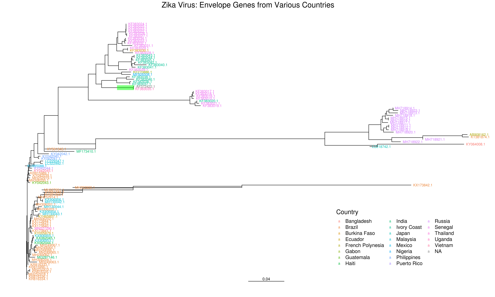

# Workflow

Instructions for this assignment can be found [here](case04_hw02_instructions.pdf).

1. Run [BLAST](http://blast.ncbi.nlm.nih.gov/Blast.cgi)
    - Query: [`case04_hw02_query.fa`](case04_hw02_query.fa)
    - Results: [`case04_hw02_blast.fa`](case04_hw02_blast.fa)
1. Search [Genbank](http://www.ncbi.nlm.nih.gov/nuccore)
    - [Query](case04_hw02_genbank.md): 
      ```
      (("Zika virus"[Organism] OR Zika virus[All Fields]) AND envelope[All Fields]) AND "Zika virus"[porgn] AND ("1"[SLEN] : "1000"[SLEN])
      ```
    - Results: 107 sequences in [`case04_hw02_genbank.fa`](case04_hw02_genbank.fa)
        - Genbank file saved in [`case04_hw02_genbank.gb`](case04_hw02_genbank.gb)
1. Find geographic origins of each sequence using [`case04_hw02_origins.sh`](case04_hw02_origins.sh)
    - Input: [`case04_hw02_genbank.gb`](case04_hw02_genbank.gb)
    - Results: 106/107 sequences have a country of origin specified in [`case04_hw02_origins.csv`](case04_hw02_origins.csv)
1. Multiple sequence alignment with [MUSCLE](http://www.ebi.ac.uk/Tools/msa/muscle/)
    - Query: [`case04_hw02_genbank.fa`](case04_hw02_genbank.fa)
    - Results: [`case04_hw02_muscle.fa`](case04_hw02_muscle.fa)
1. Build a phylogenetic tree using [Simple Phylogeny](https://www.ebi.ac.uk/Tools/phylogeny/simple_phylogeny/)
    - Query: [`case04_hw02_muscle.fa`](case04_hw02_muscle.fa)
    - Results: [`case04_hw02_tree.nwk`](case04_hw02_tree.nwk)
1. Visualize the Newick tree using [`case04_hw02_tree.R`](case04_hw02_tree.R) (using the `ggtree` R package)
    - Input: [`case04_hw02_tree.nwk`](case04_hw02_tree.nwk) and [`case04_hw02_origins.csv`](case04_hw02_origins.csv)
	- Results: [`case04_hw02_tree.png`](case04_hw02_tree.png) and [`case04_hw02_tree.pdf`](case04_hw02_tree.pdf)
	
	
1. Write the report:
    > In one or two paragarphs, write a brief discussion of your results and explain how phylogenetics could be useful to discover the source of this pathogen. Considering other related potential causes of infection, why might the concept of "Original Antigenic Sin" be important in predicting the outcome for a patient previously infected with the agent you identified in the workflow above?

    * Results: [`case04_hw02_submission.pdf`](case04_hw02_submission.pdf)
